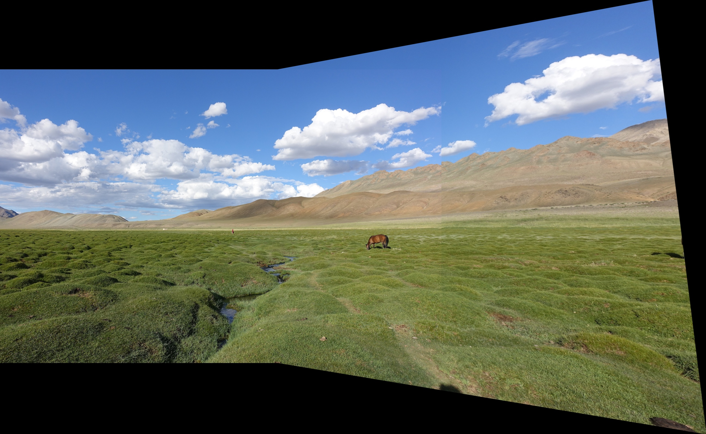

## Overview:

Panoramic Image Stitching is the process of combining multiple images with overlapping regions to produce a single panoramic image. The process involves detecting features in the images, matching the features, estimating the homography between the images, warping the images to align them, and blending the images to create a seamless panorama. This project implements the panoramic image stitching process using OpenCV and Python.

This project is a simple implementation of Panoramic Image Stitching using OpenCV and Python. The project is implemented using the following steps:
1. Feature Detection
2. Feature Matching
3. Homography Estimation
4. Image Warping
5. Image Blending


## Requirements:
1. Python 3.6 or above
2. OpenCV
3. Numpy
4. Matplotlib

## Usage:


1. Add virtual environment:
```bash
python -m venv virtenv
```

2. Load the virtual environment:
```bash
virtenv/bin/activate
```

3. Install the required libraries:
```bash
pip install -r requirements.txt
```

3. Run the code:
```bash
python ./main.py
```

## Results:
The results of the project can be found in the `data` directory. The results include the stitched image and the intermediate results of the project.

#### Input Images:


| **Input Image 1**                        | **Input Image 2**                        |
|------------------------------------------|------------------------------------------|
|      |      |


#### Panoramic Image:


## References:
1. https://opencv-python-tutroals.readthedocs.io/en/latest/py_tutorials/py_feature2d/py_feature_homography/py_feature_homography.html
2. https://www.learnopencv.com/image-alignment-feature-based-using-opencv-c-python/
3. https://www.learnopencv.com/image-stitching-using-opencv-c-python/
4. https://www.pyimagesearch.com/2016/01/11/opencv-panorama-stitching/
5. https://www.pyimagesearch.com/2018/12/17/image-stitching-with-opencv-and-python/